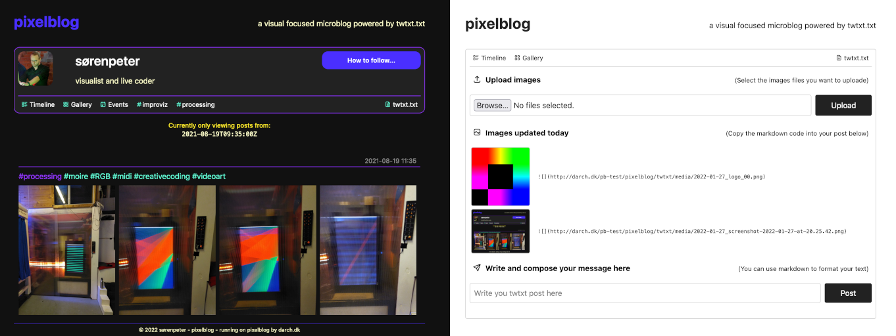

# pixelblog
A visual focused microblog powered by twtxt

Created by sørenpeter / www.darch.dk / sp@darch.dk 



## About pixelblog

Live demo at: https://darch.dk/pixelblog/

pixelblog is a visual focused selfhosted microblog using the twtxt protocol. It offers an easy way for making posts and uploading images, and having them presented in a good looking design, that you can also customize

As of now pixelblog offeres two views of your posts. A timeline view similar to how your twitter or facebook feed would look like with text, hash-tags and images. And a gallery view similar to instagram, where alle your posted images are presented in a grid design.

Using [twtxt](https://twtxt.readthedocs.io) as the backend, all your post are simply lines in a textfile and can been fetched and read by a growing number of clients.

Currently pixelblog does not offer any way to read feeds from others. For that you need a [twtxt client](https://yarn.social#manually) or a profile on a [yarn.social](https://yarn.social) pod like [twtxt.net](https://twtxt.net/)


## 🛠 Installation and setup

0. You need to have a webhosting with PHP and perferable running Apache or similar for pixelblog to work.

1. Download the code from https://github.com/sorenpeter/pixelblog as a zip

2. Upload the content of the zip to you webhosting using a FTP client
	- The default would be to put eveything from within the pixelblog-folder in the root so you will have:

		```
		www.example.net/twtxt/            (go here to to see your timeline)
		www.example.net/twtxt/gallery/    (go here to to see your gallery)
		www.example.net/twtxt/post/       (go here to to post to your feed)
		www.example.net/twtxt.txt         (where you feed lives and other can follow you)
		www.example.net/avatar.png        (your pretty picture)
		www.example.net/README.md         (can be deleted)
		```
	- or you can rename the folder `twtxt` to something else

3. Rename or make a copy of `config_template.php` and save it as `config.php`

4. Open `config.php` and edit the setting to you liking and setup

5. Open up `www.example.net/twtxt/` in your browser and check for any errors


## 🔐 Password setup

1. Go to a site like https://hostingcanada.org/htpasswd-generator/ and generate a username and password

2. Add the username and password string as a new line in `post/.htpassword`


## 📝 Posting to you twtxt feed

1. In your browser got to you site, but now add `/post` to the end so it says somthing like `www.example.net/twtxt/post`

2. Type in your username and password (see above for setup)

3. Write you message in the input field and press "Post"

## 🖼 Uploading and posting images

1. Select one or more images to upload

2. Copy the markdown code from the list to the input field together with you message or just post images if you like.
	``

__Tip:__ The default is to have each images on it own line when in timeline view. But to get a grid view with up to 5 images side by side, you can include the word `grid` in the first image of several like this:

```  ```

Only put `grid` in the square brackets of the first images unless you wants some funky side effects (you have been warrend!)


## 🎨 Customization

* Add you own `avatar.png` (can also be a .jpg or .gif)

* Open op `custom.css` and try out the provided themes by uncommenting the code

* Change the colors and other element `custom.css` to you liking

## 🪛 Advacned customization

* Mess around with the files in `layout`
	
* Add a link to `layout/nav-bar.php` to a page with your own special filter like:

`<li><a href="<?=$public_url?>?tag=event"><i class="ti ti-calendar-event"></i>Events</a></li>`

## 🚧 Current limitations

* The thumbnail function used only support local files, so if you want to use an external twtxt.txt or embed images not uploade via the `/post` feature you will need to turn it of by editing `system/Slimdown.php`


## 🧰 TODO

- [ ] Add screenshot to README
- [ ] Adding support for thumbnail external images OR skip thumnail render for external images

## 🙏 Credits and others code 

* [twtxt](https://twtxt.readthedocs.io) - the original decentralised, minimalist microblogging service for hackers
* [yarn.social](https://yarn.social/) - the multi-user pods allowed everyone to use twtxt as a social media without selfhosting
* [picoblog](https://0xff.nu/picoblog) - the PHP backend that pixelblog are using for rendering the timeline view
* [Thumb](https://github.com/jamiebicknell/Thumb) - a simple thumbnail generation script written in PHP


